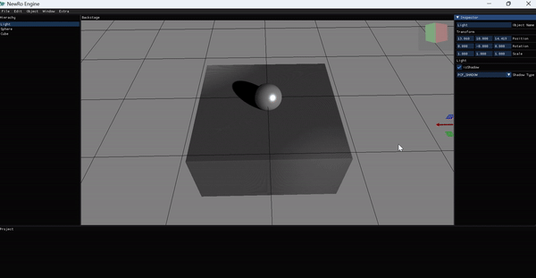

# NewRo

### **NewRo is working on 💻!**
### **Only OpenGL 3.0**

### 💡My recent goal is "CMAKE".💡

----------------------------------------------------------
## **Shaodw**

Shadow works only directional light now.

PCF ans VSM applied in my project.

Spot light and acne remove later topic.

----------------------------------------------------------
## **Animation**

Load .fbx Animation with Assimp Library.

Some Mixamo animations don't work.

----------------------------------------------------------
## **Material**

Material component change object color.

Texture variable will update asap.

----------------------------------------------------------
## Libraries
- ImGui : https://github.com/ocornut/imgui
- ImGuizmo : https://github.com/CedricGuillemet/ImGuizmo
- Meshoptimizer : https://github.com/zeux/meshoptimizer
- GLEW : https://www.glfw.org/
- Assimp : https://github.com/assimp/assimp
- GLM : https://github.com/g-truc/glm